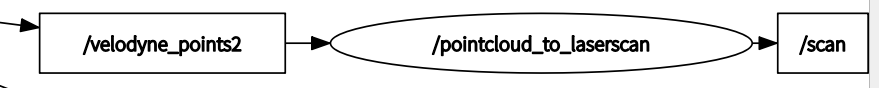
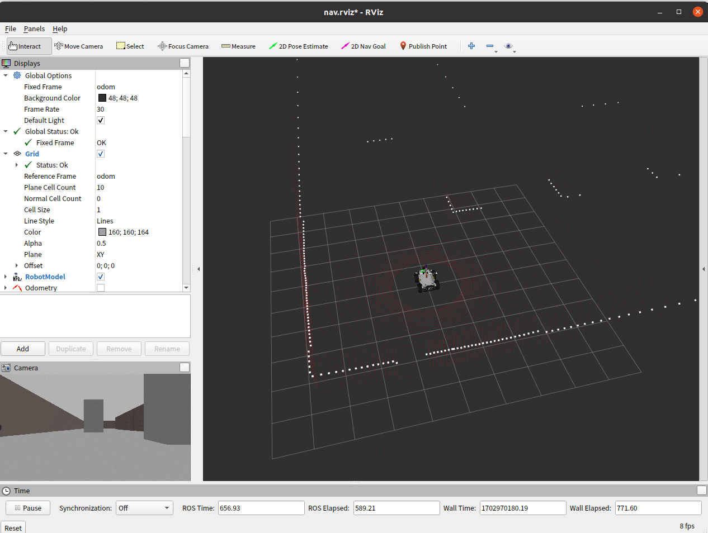
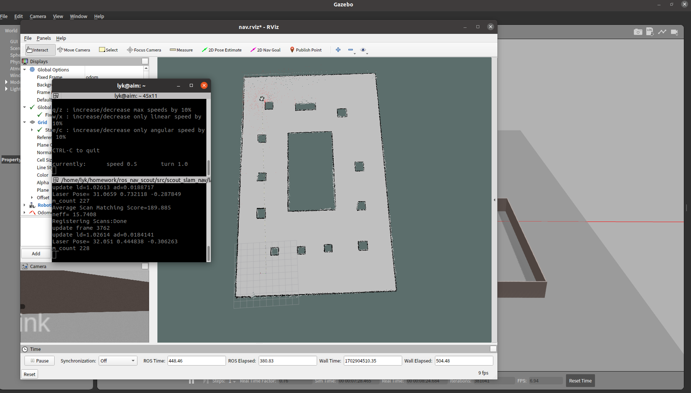
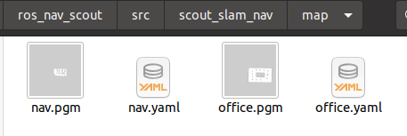
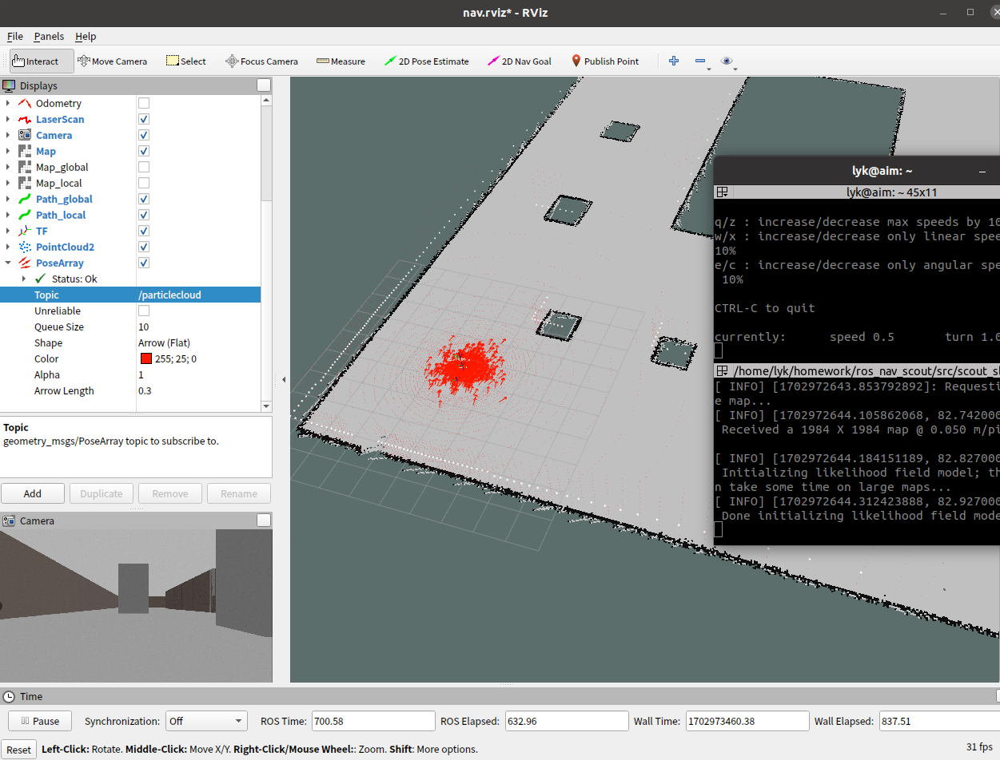
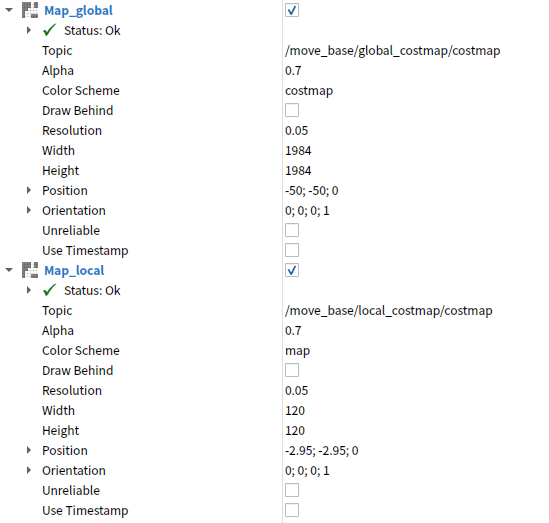
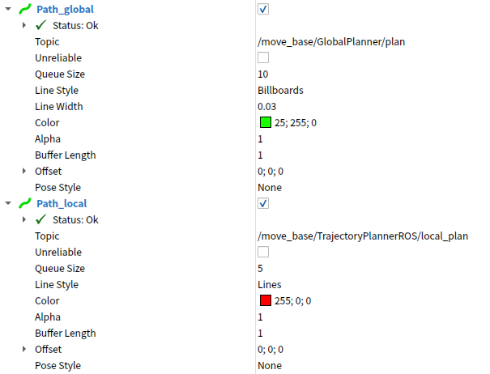
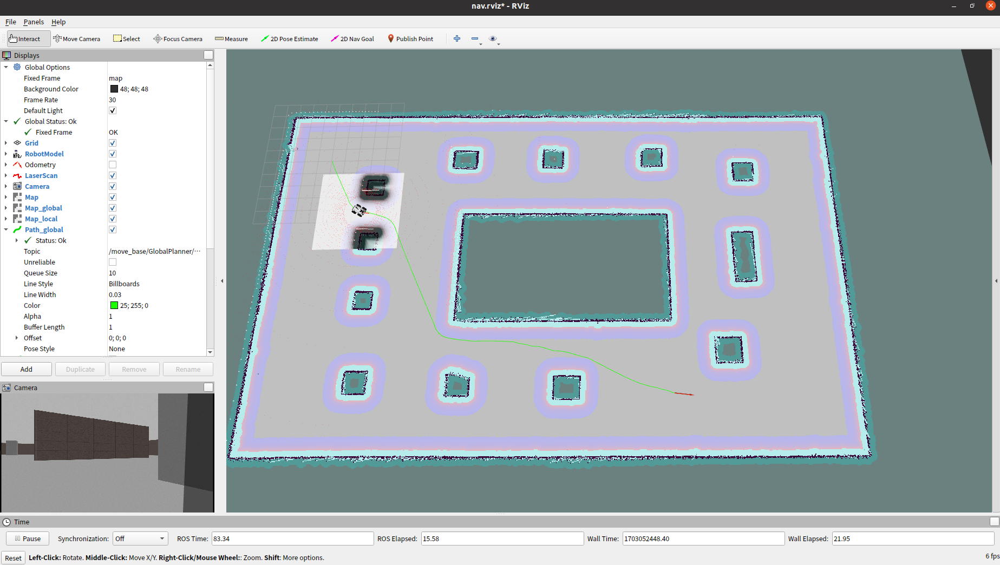
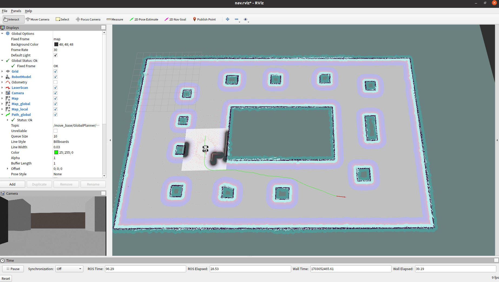

# ros_nav_scout
​	在ros中仿真松灵scout机器人的建图与导航

​	环境：ROS Noetic

​	在https://github.com/rand0md00r/ros_nav_scout基础上进行的修改，请确保你可以成功编译。

## 模型准备

​	**`scout_gazebo`**功能包的**`urdf`**中存放了小车的模型文件，**`velodyne_simulator`**功能包中是多线激光雷达的模型文件和示例程序。本仿真项目使用32线激光雷达HDL-32E进行2D建图。

​	将**`velodyne_simulator/velodyne_description/urdf`**中的`HDL-32E.urdf.xacro`放到**`scout_gazebo/urdf`**中，编辑`base.xacro`,加入如下代码：

```
<xacro:include filename="$(find scout_gazebo)/urdf/HDL-32E.urdf.xacro"/>
    <xacro:HDL-32E parent="base_link" name="velodyne2" topic="/velodyne_points2" hz="10" samples="220" gpu="${gpu}">
    <origin xyz="0 0 0.6" rpy="0 0 0" />
    </xacro:HDL-32E>
```

​	注释掉laser相关代码：

```
    <!--<xacro:include filename="$(find scout_gazebo)/urdf/laser.xacro" />-->
    <!-- <xacro:include filename="$(find scout_gazebo)/urdf/sensor_laser.xacro" />  -->
```

​	现在**`scout_gazebo/urdf`**中的`HDL-32E.urdf.xacro`已经是加入了support连杆的。

​	加入了`base_footprint`，调整了joint

```
    <!-- <link name="base_footprint"/> -->
    <link name="base_footprint">
        <visual>
            <geometry>
                <sphere radius="0.001" />
            </geometry>
        </visual>
    </link>


    <!-- 关节 -->
    <joint name="base_footprint_joint" type="fixed">
        <origin xyz="0 0 ${wheel_radius - wheel_vertical_offset}" rpy="0 0 0" />
        <parent link="base_footprint" />
        <child link="base_link" />
    </joint>
```

​	在`move.xacro`中将`base_link`改为了`base_footprint`。

​	启动并查看模型：

```
roslaunch scout_gazebo scout_gazebo.launch
```


## 建图

​	HDL-32E发布的`/velodyne_point2`是`sensor_msgs/PointCloud2`类型的点云信息，需要转换为`/scan`的`sensor_msgs/LaserScan`。

​	**`pointcloud_to_laserscan`**功能包可以实现这个功能，启动gazebo模型后

```
roslaunch pointcloud_to_laserscan point_to_scan.launch
```

​	查看节点可以看到成功转换



​	`point_to_scan.launch`中的以下参数可以调整单帧雷达数据数量（gmapping最多支持1440，超出会报错），主要是调整步长`angle_increment`。

```
angle_min: -3.1415926 # -M_PI
angle_max: 3.1415926 # M_PI
angle_increment: 0.03 # 0.003 # 0.17degree
```

​	为了方便，将其加入到了gazebo启动文件`scout_mapping.launch`中

```
<include file="$(find pointcloud_to_laserscan)/launch/point_to_scan.launch" />
```

​	建图前使用如下命令打开仿真环境

```
roslaunch scout_gazebo scout_mapping.launch
```

​	如下图




#### gmapping

​	在**`scout_slam_nav`**功能包中新建`gmapping.launch`用于建图，注意`base_frame`改为自己的基底，此包中是上述的`base_footprint`。

​	新建两个终端，分别输入命令

```
roslaunch scout_slam_nav gmapping.launch
```

```
rosrun teleop_twist_keyboard teleop_twist_keyboard.py
```

​	用键盘控制小车进行建图




#### map_saver

​	在**`scout_slam_nav`**功能包中新建`map_saver.launch`，可以将地图保存在指定路径。

```
<launch>
    <arg name="filename" value="$(find scout_slam_nav)/map/office" />
    <node name="map_save" pkg="map_server" type="map_saver" args="-f $(arg filename)" />
</launch>
```

​	执行命令

```
roslaunch scout_slam_nav map_saver.launch
```

​	路径下生成.pgm和.yaml文件




## 导航

#### map_server

​	在**`scout_slam_nav`**功能包中的`read_map.launch`为地图服务节点，可以读取指定地图。

```
<launch>
    <!-- 设置地图的配置文件 -->
    <arg name="map" default="office.yaml" />
    <!-- 运行地图服务器，并且加载设置的地图-->
    <node name="mymap" pkg="map_server" type="map_server" args="$(find scout_slam_nav)/map/$(arg map)"/>
</launch>
```


#### amcl

​	`nav.launch`中集成了地图服务和amcl，首先启动gazebo仿真环境

```
roslaunch scout_gazebo scout_mapping.launch
```

​	新开终端启动amcl

```
roslaunch scout_slam_nav nav.launch
```

​	在rviz中add`PoseArray`，选择话题`/particlecloud`，启动键盘控制节点，通过键盘控制机器人运动，会发现 `PoseArray` 也随之而改变。

​	 amcl 预估的当前机器人的位姿，箭头越是密集，说明当前机器人处于此位置的概率越高。




#### move_base

​	在启动move_base服务之前需要配置yaml文件，在功能包下 **`param`** 目录中:  costmap_common_params.yaml、local_costmap_params.yaml、global_costmap_params.yaml、base_local_planner_params.yaml等。

​	在`move_base.launch`中包含上述文件，并将`move_base.launch`集成在`nav.launch`中。

​	启动仿真环境

```
roslaunch scout_gazebo scout_mapping.launch
```

​	启动集成地图服务、amcl、move_base的`nav.launch`

```
roslaunch scout_slam_nav nav.launch
```

​	全局代价地图与本地代价地图组件配置如下:



​	全局路径规划与本地路径规划组件配置如下:



​	通过Rviz工具栏的 2D Nav Goal设置目的地实现导航。



​	将gazebo仿真环境集成到`nav.launch`，只需启动一个launch文件即可导航了。

```
<!-- 集成gazebo -->
	<include file="$(find scout_gazebo)/launch/scout_mapping.launch" />
```

​	导航过程中，在**gazebo**添加新的障碍物，机器人也可以自动躲避障碍物。


